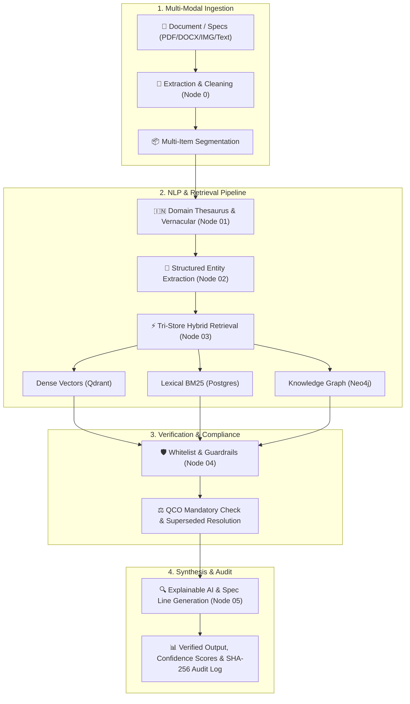

# 🏛️ ProcureMind AI — Project Documentation & Overview

> **Enterprise Hybrid Graph-RAG System for Intelligent BIS Standards Recommendation, Verification & Procurement Compliance**

---

## 📌 Executive Summary

**ProcureMind AI** is an enterprise-grade AI system designed for Indian public procurement bodies (CPWD, GeM, Indian Railways, PSUs, State Utilities) and private enterprises. It ingests complex, ambiguous tender specifications (PDF, Word, scanned images, or raw text) and matches them to certified, up-to-date **Bureau of Indian Standards (BIS)** codes, Quality Control Orders (**QCOs**), and mandatory certification schemes with **zero hallucination**.

---

## 🚀 Key System Highlights

| Feature | Description |
|---|---|
| **Multi-Modal Document Parsing** | Ingests PDF, DOCX, PNG/JPG scans, or raw text with OCR fallback |
| **Multi-Item Segmentation** | Automatically splits multi-item RFPs into parallel line items |
| **Vernacular & Domain Thesaurus** | Translates Hindi trade terms (e.g., *sariya*, *taar*), CPWD DSR (2023) codes, and GeM categories |
| **Tri-Store Hybrid Retrieval** | Combines Dense Vector Search (Qdrant), Sparse Lexical Search (PostgreSQL/BM25), and Knowledge Graph-RAG (Neo4j) with zero-dependency in-memory fallback |
| **Anti-Hallucination Guardrails** | Validates against 2,208 verified BIS whitelist records, resolving active, withdrawn, and superseded standards |
| **6-Scheme BIS Compliance** | Covers Scheme-I (ISI Mark), Scheme-II (CRS), Scheme-IV (Conformity), FMCS/Scheme-X, Eco-Mark, and Scheme-HM |
| **Vendor Technical Bid Checker** | Validates vendor bid compliance, CM/L and CRS license formats, and lab test certificate validity |
| **Modern Dashboard** | Dark-mode glassmorphic frontend built with React 18, Vite, and Tailwind CSS |

---

## 🏗️ System Architecture



---

## ⚡ Quickstart Guide

### 1. Prerequisites
- Python 3.11 or 3.12
- Node.js 18+ & npm
- *(Optional)* Docker & Docker Compose for Qdrant, Neo4j, PostgreSQL

### 2. Backend Setup
```bash
# Clone & Navigate
cd backend

# Create & Activate Virtual Environment
python -m venv venv
.\venv\Scripts\activate  # On Windows
# source venv/bin/activate  # On Linux/macOS

# Install Dependencies
pip install -r ../requirements.txt

# Run Backend Server
uvicorn main:app --reload --host 0.0.0.0 --port 8000
```

### 3. Frontend Setup
```bash
cd frontend

# Install Dependencies
npm install

# Run Development Server
npm run dev
```

---

## 🔌 API Reference

| Endpoint | Method | Description |
|---|---|---|
| `/healthz` | `GET` | Kubernetes liveness probe |
| `/readyz` | `GET` | Kubernetes readiness probe & subsystem status |
| `/ingest` | `POST` | Ingests tender documents (PDF/DOCX/image/text) |
| `/recommend` | `POST` | Executes full Graph-RAG pipeline and returns standards |
| `/bid-check` | `POST` | Evaluates vendor bid against tender standards |
| `/standard/{key}` | `GET` | Fetches details and graph relationships for an IS code |

---

## 📂 Project Structure

```
ProcureMind AI/
├── backend/                  # FastAPI Application & API Endpoints
│   ├── middleware/           # Rate limiting, security, auth
│   └── main.py               # Application entry point
├── ai/                       # LangGraph orchestration & Graph-RAG
│   ├── pipeline/             # Node 00 to 05 pipeline stages
│   ├── retrieval/            # Vector, Lexical, and Graph retrievers
│   └── models/               # Pydantic schemas & state models
├── frontend/                 # React 18 + Vite Glassmorphic Dashboard
│   ├── src/components/       # UI components (Upload, Results, BidChecker)
│   └── src/App.jsx           # Main Dashboard
├── database/                 # Seed data, migrations, Qdrant & Neo4j scripts
├── BIS_Sahayak_Clean_Data/   # Verified 1,380+ BIS standard records & gazettes
├── tests/                    # Comprehensive unit and integration test suite
├── docker-compose.yml        # Multi-container service definitions
├── requirements.txt          # Python dependencies
└── README.md                 # Full repository documentation
```

---

## 🛡️ Regulatory Compliance & Anti-Hallucination

- **2,208 BIS Code Whitelist**: Candidates undergo strict membership checking against verified gazetted Indian Standards.
- **Superseded Standard Resolution**: Obsolete standards (e.g., `IS 8828`) are automatically flagged with active replacements (e.g., `IS/IEC 60898-1`).
- **Gazette QCO Enforcer**: Matches mandatory Quality Control Orders under the BIS Act, 2016.
- **Cryptographic Auditability**: Every recommendation includes a SHA-256 hash stamp for legal tender compliance audit trails.
