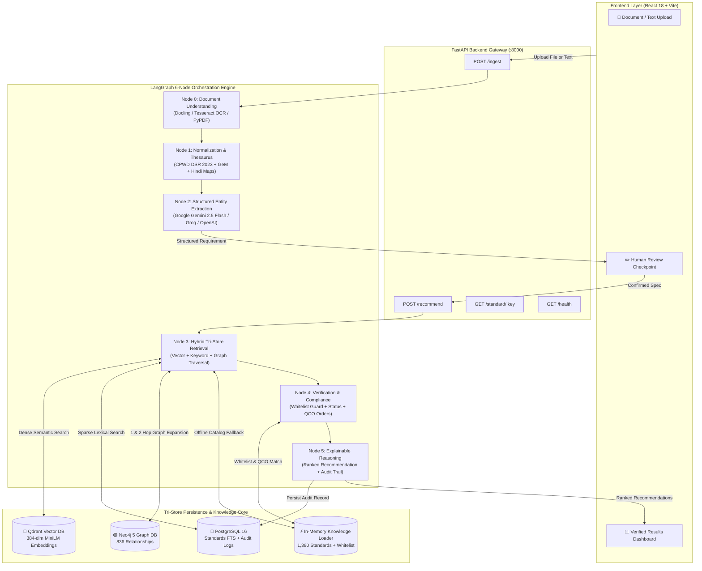
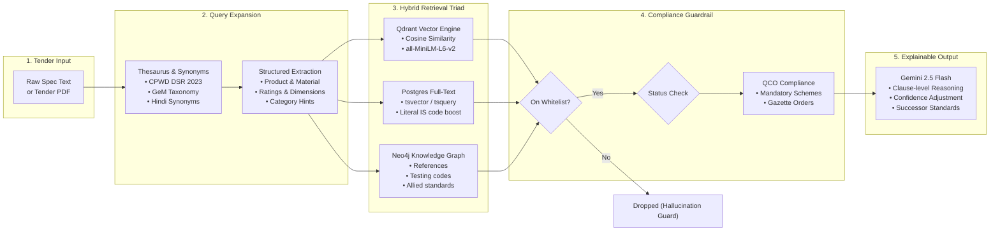
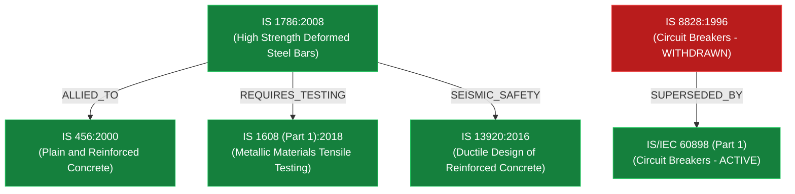

<div align="center">

# 🏛️ ProcureMind AI — BIS Standards Recommendation Engine
### *Enterprise Hybrid Graph-RAG System for Intelligent Public & Private Procurement*

[](https://www.python.org/)
[](https://fastapi.tiangolo.com/)
[](https://react.dev/)
[](https://langchain-ai.github.io/langgraph/)
[](https://qdrant.tech/)
[](https://neo4j.com/)
[](https://www.postgresql.org/)
[](https://ai.google.dev/)
[](LICENSE)

<p align="center">
  <b>A production-grade AI system that takes ambiguous, complex tender and specification documents (PDF, DOCX, scanned image, or raw text) from procurement officers and returns verified, explainable Indian Standards (IS codes), gazetted Quality Control Orders (QCOs), certification rules, and version validity — with zero hallucination.</b>
</p>

[Key Features](#-key-features) •
[Architecture & Diagrams](#-system-architecture) •
[Hybrid Graph-RAG Pipeline](#-deep-dive-the-hybrid-graph-rag-pipeline) •
[Quickstart](#-quickstart-guide) •
[API Reference](#-api-specification) •
[Evaluation & Benchmarks](#-evaluation--benchmarks)

---

</div>

## 📌 Executive Summary

Public procurement officers across Indian ministries, CPWD, PSUs, and state utilities evaluate thousands of tenders annually. They face critical challenges:
1. **Ambiguous Specifications**: Tenders written in mixed vernacular, trade terminology (e.g., *"Fe 500 TMT sariya"*), or outdated CPWD Schedule of Rates (DSR).
2. **Withdrawn & Superseded Standards**: Citations of obsolete standards (e.g., `IS 8828`) causing legal disputes, defective supplies, and audit objections.
3. **Regulatory Non-Compliance**: Failure to identify mandatory **Quality Control Orders (QCOs)** and compulsory **ISI Mark Schemes** notified by the Ministry of Commerce & Industry.
4. **LLM Hallucination Risk**: Standard commercial LLMs hallucinate non-existent standard numbers when prompted for compliance standards.

**ProcureMind AI** solves this by coupling **LangGraph state machine orchestration** with a **Tri-Store Hybrid Graph-RAG architecture** grounded in **1,380 cleaned Bureau of Indian Standards (BIS) records, 2,208 whitelist codes, 836 graph relationships, and Gazette QCO enforcement rules**.

---

## 🌟 Key Features

- 📄 **Multi-Modal Document Parsing (Node 0)**: Ingests unstructured tender PDFs, Word specifications (`.docx`), scanned images (`.png`, `.jpg`), or raw clipboard text with automatic OCR fallback.
- 📦 **Multi-Item Tender Segmentation**: Parses complex multi-item RFPs (numbered lists, bullet points, markdown tables, semicolons) into discrete `LineItem` instances, executing extraction, retrieval, and verification concurrently per line item.
- 🇮🇳 **Domain Thesaurus & Vernacular Expansion (Node 01)**: Translates vernacular Hindi procurement terms (e.g., *"sariya"*, *"cement"*, *"taar"*), maps **CPWD DSR 2023** item codes, and aligns with **Government e-Marketplace (GeM)** product categories.
- 🧠 **Structured Entity Extraction (Node 02)**: Converts raw specifications into a strict JSON schema capturing Product, Material, Technical Specs, Performance Requirements, Safety Parameters, and Intended Application.
- ⚡ **Tri-Store Hybrid Retrieval (Node 03)**:
  - **Dense Vector Search**: Qdrant vector index using `all-MiniLM-L6-v2` embeddings (384-dimensional cosine similarity).
  - **Sparse Lexical Search**: PostgreSQL Full-Text Search (`to_tsvector` & `plainto_tsquery`) and field-weighted BM25 with procurement stopword elimination.
  - **Graph-RAG Expansion**: Neo4j Knowledge Graph traversing relationships (`REFERENCES`, `ALLIED`, `REQUIRES_TESTING`, `SUPERSEDED_BY`, etc.).
  - **In-Memory Catalog Fallback**: Fully self-contained in-memory search and relationship graph for zero-setup execution when database containers are offline.
- 🛡️ **Anti-Hallucination Guardrails & Regulatory Compliance (Node 04)**:
  - **Hard Whitelist Verification**: Automatically filters any candidate not present in the official 2,208 BIS code whitelist.
  - **Status Resolution**: Flags `ACTIVE`, `WITHDRAWN`, and `SUPERSEDED` standards. Prominently promotes active successor standards (e.g., `IS 8828` ➔ `IS/IEC 60898 (Part 1)`).
  - **Comprehensive 6-Scheme BIS Compliance**: Covers **Scheme-I** (ISI Mark), **Scheme-II** (CRS for electronics/IT), **Scheme-IV** (Certificate of Conformity), **FMCS / Scheme-X** (Foreign Manufacturers), **Eco-Mark**, and **Scheme-HM** (Hallmarking) with statutory marking requirements and testing protocols.
- 🔍 **Explainable AI & Deterministic Spec Line (Node 05)**:
  - Synthesizes transparent, clause-level justifications explaining *why* each IS code matches the tender.
  - Generates copy-paste-ready deterministic tender clauses (`spec_line`) with QCO rejection enforcement notes.
  - Calibrated dual-gate confidence and abstention scoring ($0.0$ to $1.0$).
  - Immutable cryptographic SHA-256 audit log persisted to SQLite/PostgreSQL.
- 📋 **Technical Bid Check Tool (`POST /bid-check`)**:
  - Automatically evaluates vendor technical bids against tender mandatory and voluntary standards.
  - Validates **CM/L** (`CM/L-XXXXXXXXXX`) and **CRS** (`R-XXXXXXXX`) license number formats, checks test certificate age ($\le 180$ days), and flags superseded standard submissions.
- 🔒 **Security & Operational Hardening**:
  - Trusted-proxy rate limiting (strictly validating `X-Forwarded-For` from configured proxy CIDRs).
  - Optional API Key authentication (`X-API-Key`) with public bypass for health and OpenAPI documentation.
  - Kubernetes liveness (`/healthz`) and readiness (`/readyz`) probes.
  - Hard body size and 20k character input length limits with sanitized 500 error responses.
- 💻 **Modern Glassmorphic Web Dashboard**:
  - Dark-mode responsive UI built in React 18, Vite, and Tailwind CSS.
  - Live document drop-zone, one-click preset tenders, human-in-the-loop review checkpoint, and interactive graph explorer modal.

---

## 🏛️ System Architecture

### High-Level End-to-End Topology



---

## 🔬 Deep Dive: The Hybrid Graph-RAG Pipeline



### The 6 Pipeline Nodes Explained:

| Node | Name | Responsibility | Degraded / Fallback Mode |
|:---:|:---|:---|:---|
| **00** | **Document Understanding** | Parses raw uploaded files (`.pdf`, `.docx`, `.png`, `.jpg`). Extracts clean text via OCR or structured document extractors. | Passes through raw text if plain query is provided. |
| **01** | **Ingest & Thesaurus** | Normalizes whitespace, detects input language, expands procurement terms using CPWD DSR 2023, GeM classification, and Hindi vernacular dictionaries. | Uses standard regex normalization if thesaurus files are missing. |
| **02** | **Structured Extraction** | Prompts LLM to extract JSON: `product`, `material`, `specifications`, `performance_requirements`, `safety_requirements`, `application`, `category_hint`. | Rule-based regex and keyword entity extractor when LLM key is pending or network is down. |
| **03** | **Hybrid Retrieve** | Executes parallel vector search (Qdrant), keyword search (PostgreSQL FTS), and graph expansion (Neo4j). Boosts explicitly mentioned IS codes. | Seamlessly falls back to pre-indexed in-memory catalog search across all 1,380 standards. |
| **04** | **Verify & Comply** | Validates candidates against `is_code_whitelist_clean.json`. Resolves status (`ACTIVE`, `WITHDRAWN`, `SUPERSEDED`). Matches gazetted QCO rules. | In-memory QCO and whitelist indices ensure 100% operation without PostgreSQL. |
| **05** | **Recommend & Audit** | LLM ranks candidates, computes calibrated confidence scores, and synthesizes 2–4 sentence clause-level explanations. Logs audit entry to DB. | Rule-based justification generator citing matched scope, grade, and mandatory certification. |

---

## 🗄️ Knowledge Graph Schema (Neo4j)

The Neo4j graph connects standards and their testing, safety, and regulatory dependencies:



---

## 🚀 Quickstart Guide

### Prerequisites
- **Python**: `3.10` or higher (`3.12` recommended)
- **Node.js**: `18.x` or higher & `npm`
- **Docker & Docker Desktop** *(Optional — system has full in-memory fallback)*

---

### Option A: 1-Click Launch (Windows)

#### 1. Start the Backend Server
Double-click `run_backend.bat` or run:
```powershell
.\run_backend.bat
```
- API starts at: `http://localhost:8000`
- Swagger Interactive Documentation: `http://localhost:8000/docs`

#### 2. Start the Frontend Dashboard
In a second terminal, double-click `run_frontend.bat` or run:
```powershell
.\run_frontend.bat
```
- Web Application opens at: `http://localhost:5173`

---

### Option B: Manual Setup

#### 1. Clone & Configure Environment
```bash
git clone https://github.com/Anu7276/ProcureMind_AI.git
cd "ProcureMind AI"

# Copy environment configuration
cp .env.example .env
```

#### 2. Install Dependencies
```bash
# Python backend & AI pipeline dependencies
pip install -r requirements.txt

# React frontend dependencies
cd frontend
npm install
cd ..
```

#### 3. (Optional) Launch Infrastructure Containers
```bash
# Spins up PostgreSQL 16, Qdrant Vector DB, and Neo4j 5
docker compose up -d

# Ingest BIS dataset into all three stores
python database/ingestion/ingest_all.py
```

#### 4. Run Servers
```bash
# Terminal 1: Backend
python -m uvicorn backend.main:app --host 0.0.0.0 --port 8000 --reload

# Terminal 2: Frontend
cd frontend
npm run dev
```

#### 5. Run Automated Tests
```bash
# Run all 86 unit and integration test suites
pytest -q

# Run end-to-end procurement scenarios specifically
pytest -q tests/test_procurement_report.py
```

---

## 🔑 LLM Provider Configuration

The engine supports multiple leading LLM providers out of the box. You can configure them via the interactive CLI tool or directly in `.env`:

### Interactive Configurator
```powershell
python update_env_api_key.py
```

### Manual Configuration (`.env`)

| Provider | `LLM_PROVIDER` | API Key Variable | Default Model |
|---|---|---|---|
| **Google Gemini** *(Recommended)* | `google` | `GOOGLE_API_KEY` | `gemini-2.5-flash` |
| **Groq** *(Ultra-fast)* | `groq` | `GROQ_API_KEY` | `qwen/qwen3.8-27b` |
| **OpenAI** | `openai` | `OPENAI_API_KEY` | `gpt-4o-mini` |
| **Anthropic** | `anthropic` | `ANTHROPIC_API_KEY` | `claude-3-haiku-20240307` |
| **Ollama** *(Local Open-Source)* | `ollama` | *None required* | `mistral` (via `http://localhost:11434`) |
| **Mock Fallback** *(Offline)* | `mock` | *None required* | Heuristic NLP & Domain Extractor |

> **Note**: If no API key is provided, the system automatically uses the intelligent `MockChatModel` so the entire pipeline runs end-to-end without throwing exceptions.

---

## 📡 API Specification

Interactive Swagger UI documentation is available at `http://localhost:8000/docs`.

### 1. `POST /recommend`
Run the complete recommendation pipeline on raw text or confirmed structured requirements.

**Request Body (Raw Query):**
```json
{
  "raw_query": "Supply of Fe 500D TMT steel bars for RCC framed structures, diameter 16mm",
  "top_k": 5
}
```

**Response (`200 OK`):**
```json
{
  "audit_id": "8f3b62c1-382a-4288-9d41-e970a256a471",
  "structured_requirement": {
    "product": "TMT steel bars",
    "material": "Fe 500D",
    "specifications": "16mm dia",
    "performance_requirements": "High tensile strength and ductility",
    "safety_requirements": "Mandatory ISI mark",
    "application": "RCC building construction",
    "category_hint": "Civil & Construction"
  },
  "recommendations": [
    {
      "is_code": "IS 1786:2008",
      "key": "IS 1786",
      "title": "High Strength Deformed Steel Bars/Wires for Concrete Reinforcement",
      "confidence": 1.0,
      "status": "ACTIVE",
      "verification_level": "verified_multi_source",
      "flags": [],
      "certification": {
        "mandatory": true,
        "scheme_name": "Scheme-I (ISI Mark)",
        "lead_time_weeks": 6,
        "penalty": "Fine up to Rs. 5,00,000 and/or imprisonment under BIS Act 2016",
        "evidence_source": "qco_orders.json (QCO-STEEL-2023)"
      },
      "related_standards": [
        { "key": "IS 456", "title": "Plain and Reinforced Concrete", "relationship_type": "ALLIED" },
        { "key": "IS 13920", "title": "Ductile Design of Concrete Structures", "relationship_type": "SEISMIC_SAFETY" }
      ],
      "reasoning": "IS 1786:2008 directly governs high strength deformed steel bars including Fe 500D for RCC structures. It is subject to mandatory Quality Control Order compliance under Scheme-I."
    }
  ],
  "pipeline_warnings": []
}
```

---

### 2. `POST /ingest`
Multi-modal file ingestion endpoint. Accepts `.pdf`, `.docx`, or images and returns normalized text and extracted structured requirements for human review.

---

### 3. `POST /bid-check`
Technical bid compliance evaluation endpoint. Compares submitted vendor certificates, CM/L or CRS license numbers, and standards against tender requirements.

**Sample Request**:
```json
{
  "required_standards": ["IS 1786", "IS 8112"],
  "vendor_submission": {
    "vendor_name": "Apex Infra Supplies Ltd",
    "submitted_codes": ["IS 1786:2008", "IS 8112:2013"],
    "license_numbers": ["CM/L-1234567890", "CM/L-9876543210"],
    "test_certificate_dates": ["2026-08-01", "2026-08-15"]
  }
}
```

---

### 4. `GET /standard/{key}`
Direct lookup endpoint for any Indian Standard. Returns complete metadata, certification rules, and graph neighbors.

**Example**: `GET /standard/IS%201786`

---

### 5. `GET /health`, `GET /healthz`, `GET /readyz`
- `/health`: Detailed diagnostics checking latency for PostgreSQL, Qdrant, and Neo4j.
- `/healthz`: Lightweight liveness probe returning `200 OK`.
- `/readyz`: Kubernetes readiness probe verifying standards catalog loading.

---

## 🧪 Evaluation & Benchmarks

The engine includes an automated evaluation harness benchmarking against both the **75 ground-truth procurement queries** (`queries_master.json`) and the **realistic 60-query set** with 20 out-of-scope hard negatives (`queries_realistic.json`).

### Running the Evaluation
```powershell
# Standard 75-query benchmark with delta against baseline
python ai/evaluation/eval_runner.py --compare ai/evaluation/baseline.json

# Realistic holdout evaluation
python ai/evaluation/eval_runner.py --realistic holdout
```

### Benchmark Results (Before vs. After Optimization)

| Metric | Baseline | Current Engine | Improvement |
| :--- | :--- | :--- | :--- |
| **Exact Recall@1** | 10.7% | **64.0%** | **+53.3%** |
| **Exact Recall@3** | 40.0% | **77.3%** | **+37.3%** |
| **Exact Recall@5** | 73.3% | **81.3%** | **+8.0%** |
| **Exact MRR** | 0.309 | **0.714** | **+0.405** |
| **Family Recall@1** | 17.3% | **76.0%** | **+58.7%** |
| **Family Recall@3** | 53.3% | **89.3%** | **+36.0%** |
| **Family Recall@5** | 86.7% | **93.3%** | **+6.7%** |
| **Family MRR** | 0.406 | **0.836** | **+0.430** |

#### Realistic Holdout & Abstention Metrics
- **Abstention Precision**: `80.0%`
- **Abstention Recall**: `80.0%`
- **Abstention F1 Score**: `0.800`
- **In-Scope Family Recall@5**: `85.0%`

---

## 📁 Repository Directory Structure

```
ProcureMind AI/
├── ai/
│   ├── evaluation/               # Evaluation runner & benchmark datasets
│   │   ├── eval_runner.py        # Automated test executor & comparator
│   │   ├── queries_master.json   # 75 curated evaluation queries
│   │   └── queries_realistic.json# 60 realistic queries (40 in-scope, 20 hard negatives)
│   ├── knowledge/                # In-memory standards knowledge base
│   │   ├── knowledge_loader.py   # BM25 indexer, thesaurus loader, graph cache
│   │   ├── text_utils.py         # Tokenizer & procurement stopwords
│   │   └── version_checker.py    # Successor & amendment status validator
│   ├── llm/                      # Multi-provider LLM abstraction
│   │   ├── llm_factory.py        # Factory for Gemini, Groq, OpenAI, Anthropic
│   │   ├── mock_llm.py           # Offline fallback LLM generator
│   │   └── prompts.py            # Calibrated extraction & reasoning prompts
│   └── pipeline/                 # LangGraph state machine nodes
│       ├── bid_check.py          # Technical bid compliance engine
│       ├── segmenter.py          # Multi-item tender parser
│       ├── graph.py              # Compiled LangGraph workflow topology
│       ├── state.py              # PipelineState TypedDict definition
│       └── nodes/                # Execution nodes 00 through 05
│           ├── node_00_document.py
│           ├── node_01_ingest.py
│           ├── node_02_extract.py
│           ├── node_03_retrieve.py
│           ├── node_04_verify.py
│           └── node_05_recommend.py
├── backend/
│   ├── api/routes/               # FastAPI route controllers
│   │   ├── bid_check.py          # Vendor bid check endpoint
│   │   ├── health.py             # System health, healthz & readyz probes
│   │   ├── ingest.py             # File upload and OCR ingest handler
│   │   ├── recommend.py          # Primary recommendation controller
│   │   └── standard.py           # Single-standard drilldown & graph neighbours
│   ├── config/                   # Configuration & environment settings
│   │   └── settings.py           # Pydantic BaseSettings singleton
│   ├── middleware/
│   │   └── security.py           # Trusted-proxy rate limiting & API key auth
│   ├── models/                   # SQLAlchemy ORM models
│   ├── schemas/                  # Pydantic request/response schemas
│   │   └── api_schemas.py
│   ├── services/                 # External service clients
│   │   ├── neo4j_service.py      # Async Neo4j graph driver
│   │   ├── postgres_service.py   # Async SQLAlchemy / asyncpg engine
│   │   └── qdrant_service.py     # Async Qdrant vector client
│   └── main.py                   # FastAPI application lifespan & CORS setup
├── tests/                        # 86 automated PyTest unit & integration tests
│   ├── test_procurement_report.py# 8 core procurement scenarios
│   ├── test_multi_item_segmenter.py
│   ├── test_bid_check.py
│   ├── test_certification_schemes.py
│   ├── test_security_and_health.py
│   └── ...
├── database/
│   ├── ingestion/                # Bulk data ingestion scripts
│   │   ├── ingest_all.py         # Orchestrator for all three stores
│   │   ├── ingest_neo4j.py       # Graph loader for nodes & relationships
│   │   ├── ingest_postgres.py    # SQL schema population
│   │   └── ingest_qdrant.py      # Embedding generation & vector upsert
│   └── postgres/
│       └── init.sql              # Database DDL: 5 tables + GIN FTS index
├── frontend/                     # React 18 Web Dashboard
│   ├── src/
│   │   ├── pages/                # UploadPage, ReviewPage, ResultsPage
│   │   ├── services/             # Axios API integration
│   │   ├── App.jsx               # React Router configuration
│   │   ├── index.css             # Tailwind CSS tokens & glassmorphism
│   │   └── main.jsx              # React DOM entry point
│   ├── package.json
│   ├── tailwind.config.js
│   └── vite.config.js
├── .env.example                  # Documented environment variable template
├── docker-compose.yml            # Container orchestration for Postgres, Qdrant, Neo4j
├── requirements.txt              # Pinned Python package dependencies
├── run_backend.bat               # 1-click Windows batch script for Backend
├── run_frontend.bat              # 1-click Windows batch script for Frontend
└── update_env_api_key.py         # Interactive CLI API key configurator
```

---

## 🛡️ License & Acknowledgements

- **License**: Released under the [MIT License](LICENSE).
- **Data Source**: Standard metadata, Quality Control Orders, and relationship graphs are sourced from official publications by the **Bureau of Indian Standards (BIS)** and the **Department for Promotion of Industry and Internal Trade (DPIIT)**.
- **Frameworks**: Built using [LangGraph](https://github.com/langchain-ai/langgraph), [FastAPI](https://fastapi.tiangolo.com/), [Qdrant](https://qdrant.tech/), [Neo4j](https://neo4j.com/), and [Tailwind CSS](https://tailwindcss.com/).
